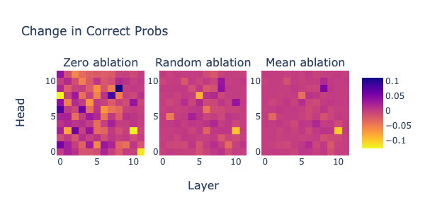
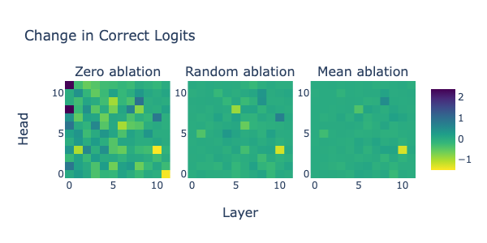
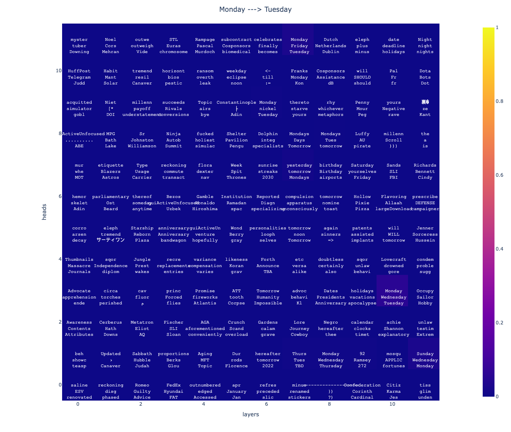
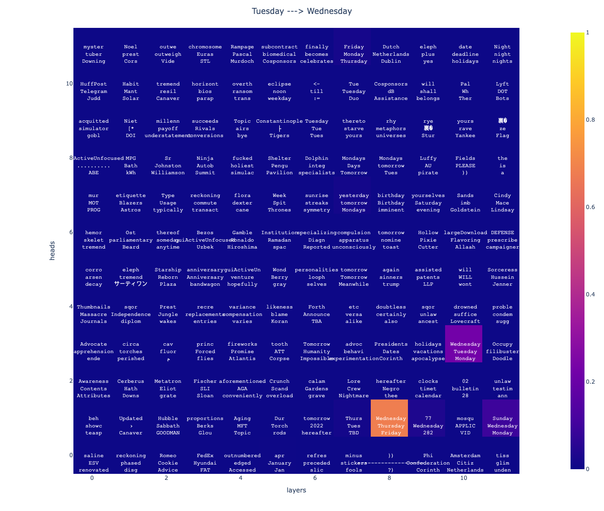
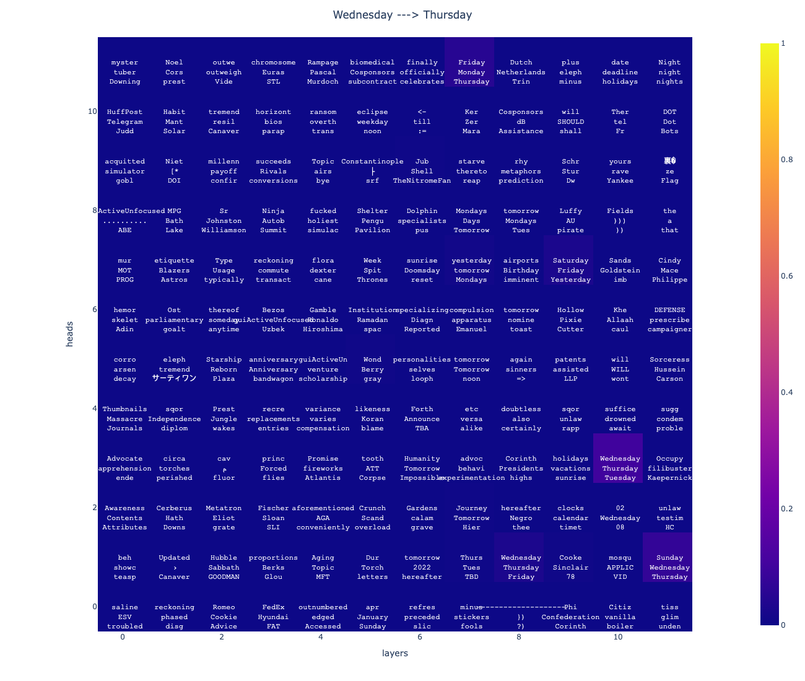
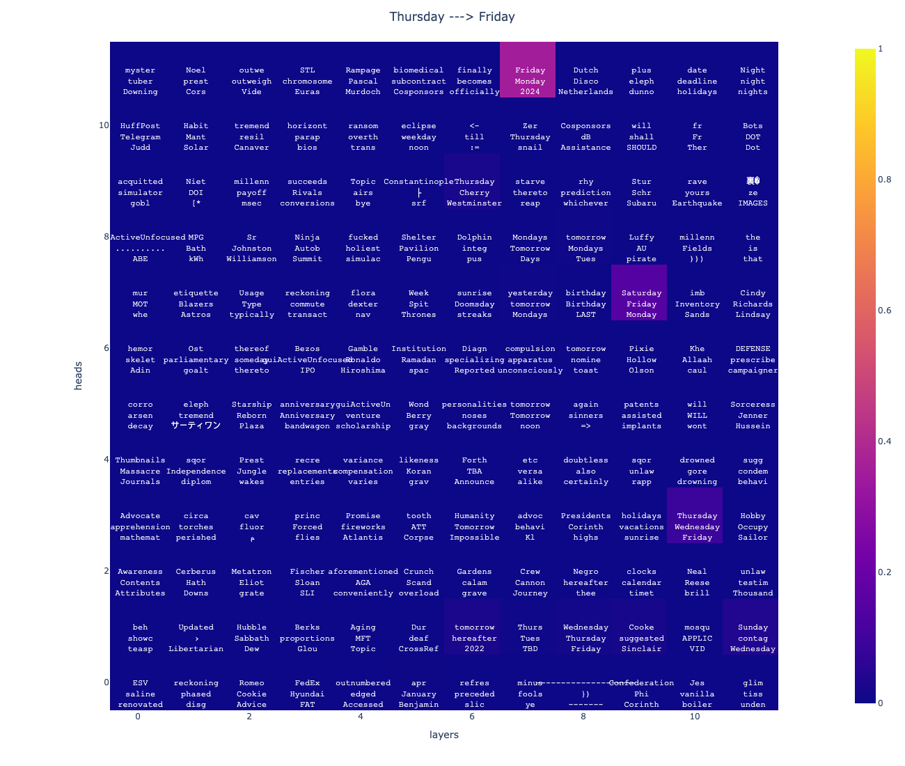
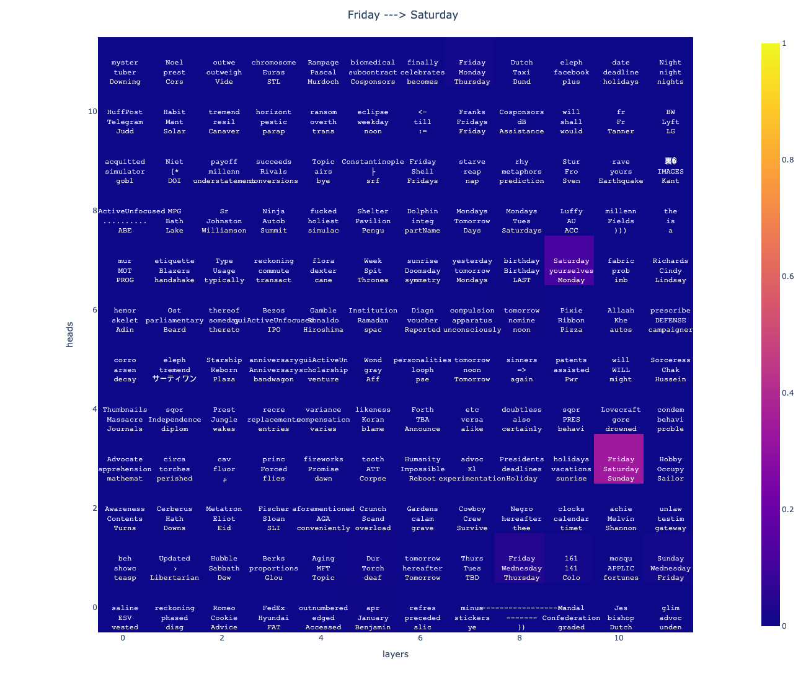
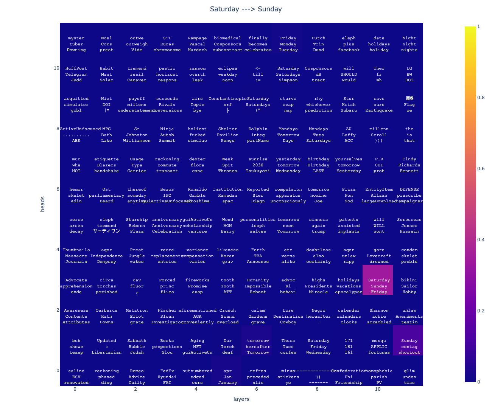
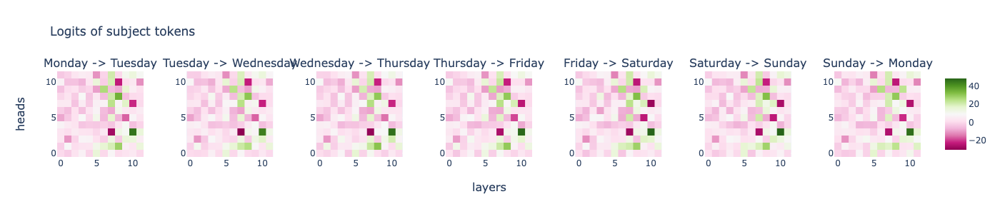

# ARENA_Capstone
### Capstone project for ARENA 3.0

This is a replication of the results from [Mechanistically interpreting time in GPT-2 small](https://www.lesswrong.com/posts/6tHNM2s6SWzFHv3Wo/mechanistically-interpreting-time-in-gpt-2-small).

## Plots for change in the correct probabilities and correct logits**
*The change in correct probabilities and correct logits after ablating head (i, j) according to zero ablation, random ablation, and mean ablation*

Note: correct probabilty/logit refers to the probability/logit of predicting the correct subsequent day 

**Observations from plots** 
*Top 3 commonly predicted tokens for every head in GPT2-small*

- Head (10, 3) consistently predicts days in its top three; however, it almost always most strongly predicts the *subject day* rather than the correct *subsequent day*
    - The top 3 days predicted by this head always includes the correct *subsequent day*
    - Exception: this head predicts the correct *subsequent day* when the *subject day* is Tuesday (i.e. it most strongly predicts Wednesday)
- Head (8, 1) also consistently predicts days in its top three (somewhat at random); it strongly predicts the correct token following Tuesday

## Plots for the probabilities and logits of predicting subject tokens

**Observations from plots**
- Head (10, 3) seems to be a copying head as it is consistently a medium to strong predictor of the *subject day*
- Other potential copying heads: 
    - (6, 9) with the exception of Wednesday->Thursday
    - occassionally (8, 1)

## Examining head (9, 1)
The paper hypothesizes that head (9, 1) is the actual "next-day-prediction" head.
