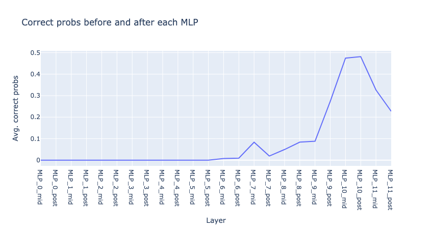
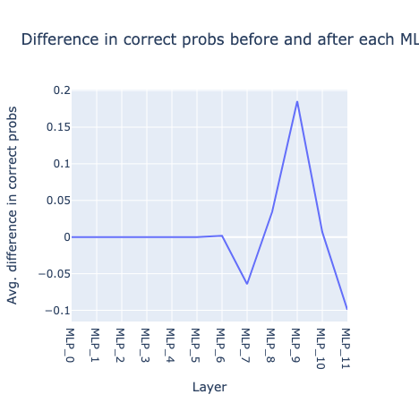
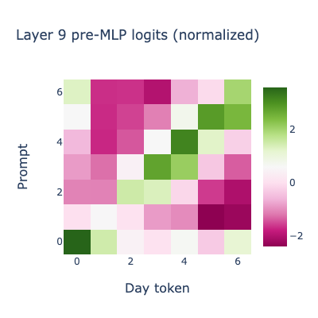
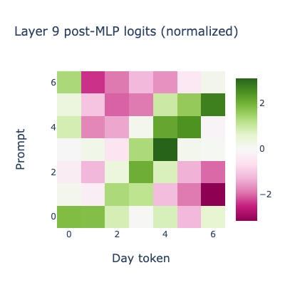
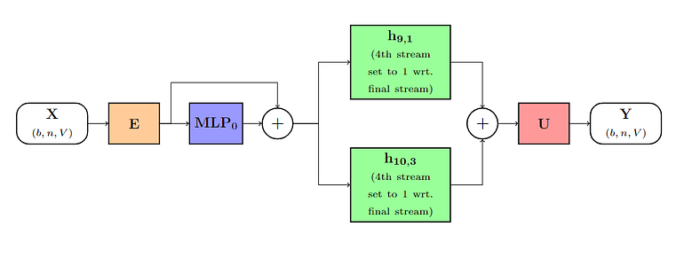
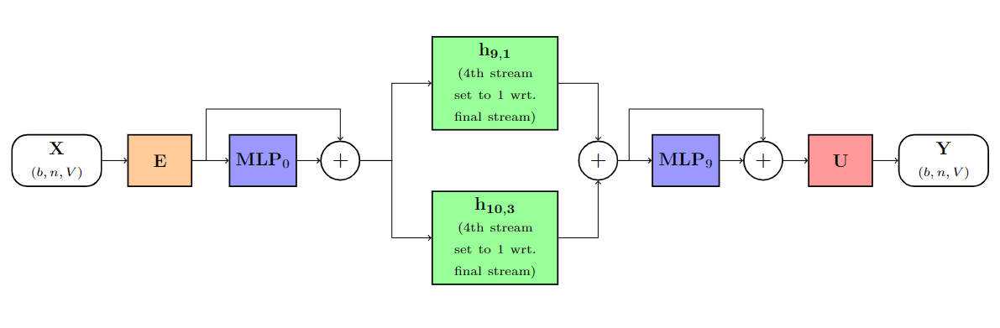

# ARENA_Capstone
### Capstone project for ARENA 3.0

This is a replication of the results from [Mechanistically interpreting time in GPT-2 small](https://www.lesswrong.com/posts/6tHNM2s6SWzFHv3Wo/mechanistically-interpreting-time-in-gpt-2-small).

## Overview
This paper explores a potential circuit for understanding temporal relations in GPT-2-small. More specifically, the task is to find a circuit that can accurately complete prompts in the following form: "If today is [some day], then tomorrow is ____". 

It is shown that a circuit as simple as 2 attention heads and 2 MLP layers is sufficient for this task and that this circuit generalizes well to other tasks involving temporal relations.

## Plots for change in the correct probabilities and correct logits
*The change in correct probabilities and correct logits after ablating head (i, j) according to zero ablation, random ablation, and mean ablation*

Note: correct probabilty/logit refers to the probability/logit of predicting the correct subsequent day 

## Logit Lens: Plots of top 3 token predictions for every head
*Top 3 commonly predicted tokens for every head in GPT2-small*

Note: the color gradient is based on the correct probabilites at each head 

### Observations from plots
- Head (10, 3) consistently predicts days in its top three; however, it almost always most strongly predicts the *subject day* rather than the correct *subsequent day*
    - The top 3 days predicted by this head always includes the correct *subsequent day*
    - Exception: this head predicts the correct *subsequent day* when the *subject day* is Tuesday (i.e. it most strongly predicts Wednesday)
- Head (8, 1) also consistently predicts days in its top three (somewhat at random); it strongly predicts the correct token following Tuesday
- Head (9, 1) seems to be a day predictor

## Attention head patterns
**Note: The first tokens on both axes in the attention patterns are the BOS token. On the attention pattern grids, the y-axis represents queries from tokens 0-7 (from top to bottom) while the x-axis represents keys from tokens 0-7 (from left to right) 

We can further examine the attention patterns of heads (9, 1) and (10, 3):
")

Most tokens seem to attend to the BOS token. The "is" token very slightly attends to the *subject day* token.

")

The tokens "is" and "," attend strongly to the *subject day* token (i.e. "Monday" in this example). This head also moderately pays attention to the token "today".

## Plots for the probabilities and logits of predicting subject tokens

### Observations from plots
- Head (10, 3) seems to be a copying head as it is consistently a medium to strong predictor of the *subject day*
- Other potential copying heads: 
    - (6, 9) with the exception of Wednesday->Thursday
    - occassionally (8, 1)

## Logit for all day-tokens across all prompts

### Examining head (9, 1)
The paper hypothesizes that head (9, 1) is the actual "next-day-prediction" head. Below is a plot showing the logits for all days for each prompt for the head (9, 1).

")

The diagonal below the main diagonal demonstrates particularly high logit values, supporting the theory that this head is the true next-token predicting head.

### Examining head (10, 3)
The paper hypothesizes that head (10, 3) is a head that simply copies information from the *subject day*. Below is a plot showing the logits for all days for each prompt for the head (10, 3).

")

The main diagonal demonstrates particularly high logit values, particularly for prompts with *subject day* Thursday through Saturday, supporting the theory that this head pushes the answer towards the *subject day*.

## Examining the role of MLPs
Apply logit lens in the residual stream before and after the MLP in each layer (i.e. at resid_mid and at resid_post).

Graphing the correct probabilities at resid_pre (before MLP) and resid_post (after MLP) in each layer:

Graphing the difference in correct probabilities between resid_pre and resid_post in each layer:

### Observations
For the correct probabilities pre- and post- MLP:
- Sharp increase in correct probabilities at MLP_7_pre and MLP_10_pre (function of operations in attention layer 7 and attention layer 10)
- Sharp increase in correct probabilities at MLP_9_post (function of operations in MLP of layer 9)
- Sharp decrease in correct probabilities at MLP_11_pre

For the *differences* in probabilities between pre- and post- MLP locations in the residual stream:
- MLP_7, MLP_10, and MLP_11 seem to be destructive (caused a decrease in correct probs)
- MLP_8 and MLP_9 are constructive (caused an increase in correct probs)
- Overall, MLP_10 appears to be the most destructive while MLP_9 seems the most constructive

## Pre- and post- layer 9 MLP

Normalized logit predictions for each day across all prompts pre-MLP-9:

Normalized logit predictions for each day across all prompts post-MLP-9:

MLP_9 shifts logits from the main diagonal to right below the diagonal.

## Final circuit components
**Embedding --> MLP_0 --> h (9, 1) + h (10, 3) --> Unembedding**

(Image credits to the original post)

Probabilities of correct tokens:  [0.2806, 0.3363, 0.1380, 0.1386, 0.0562, 0.1253, 0.0528]

**Embedding --> MLP_0 --> h (9, 1) + h (10, 3) --> MLP_9 --> Unembedding**

(Image credits to the original post)

Probabilities of correct tokens: [0.5068, 0.8984, 0.7088, 0.5942, 0.5724, 0.6629, 0.2436]
*Note: the original paper got higher probabilities, in which case the circuit would produce the correct answer for every prompt.

**Compare this to the original correct probabilities for the entire GPT-2-small model:** [0.2212, 0.2244, 0.2104, 0.2059, 0.2226, 0.3074, 0.1988]

## Application to similar tasks
Note: It turns out that this general circuit pattern works for predicting months as well, i.e. predicting something of the form "If this month is [some month], next month is ____"

Using the same general circuit (except changing the attention in (9, 1) and (10, 3) to be on the 5th stream), the original paper gets decently high correct probabilities. 

A very similar circuit setup produces very good results for prompts of the form "If [some number] then ____", where the task is predicting the next number.

